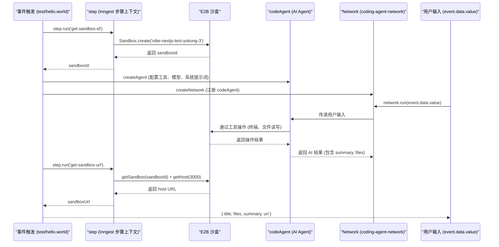

```mermaid
%% helloWorld 函数时序图
%% 该图描述了 Inngest Function 处理流程、Agent、E2B 沙盒的交互

sequenceDiagram
    participant Event as "事件触发 (test/hello.world)"
    participant Step as "step (Inngest 步骤上下文)"
    participant Sandbox as "E2B 沙盒"
    participant Agent as "codeAgent (AI Agent)"
    participant Network as "Network (coding-agent-network)"
    participant User as "用户输入 (event.data.value)"

    %% 1. 创建沙盒
    Event->>Step: step.run('get-sandbox-id')
    Step->>Sandbox: Sandbox.create('vibe-nextjs-test-yokong-3')
    Sandbox-->>Step: 返回 sandboxId
    Step-->>Event: sandboxId
    %% 注释：首先通过 E2B 创建一个隔离的沙盒环境，后续所有操作都在此环境中进行

    %% 2. 创建 Agent
    Event->>Agent: createAgent (配置工具、模型、系统提示词)
    %% 注释：Agent 配置了终端、文件读写等工具，具备代码能力

    %% 3. 创建 Network
    Event->>Network: createNetwork (注册 codeAgent)
    %% 注释：Network 用于管理 Agent 的执行流程和状态

    %% 4. 运行 Network (核心流程)
    User->>Network: network.run(event.data.value)
    Network->>Agent: 传递用户输入
    Agent->>Sandbox: 通过工具操作 (终端、文件读写)
    Sandbox-->>Agent: 返回操作结果
    Agent-->>Network: 返回 AI 结果 (包含 summary, files)
    %% 注释：用户输入驱动 Agent 进行代码生成、命令执行、文件操作等，所有操作都在沙盒内完成

    %% 5. 获取沙盒 URL
    Event->>Step: step.run('get-sandbox-url')
    Step->>Sandbox: getSandbox(sandboxId) + getHost(3000)
    Sandbox-->>Step: 返回 host URL
    Step-->>Event: sandboxUrl
    %% 注释：获取沙盒的 Web 访问地址，便于用户访问生成的应用或页面

    %% 6. 返回最终结果
    Event-->>User: { title, files, summary, url }
    %% 注释：最终返回生成的文件、摘要和沙盒访问链接，供前端展示

```
